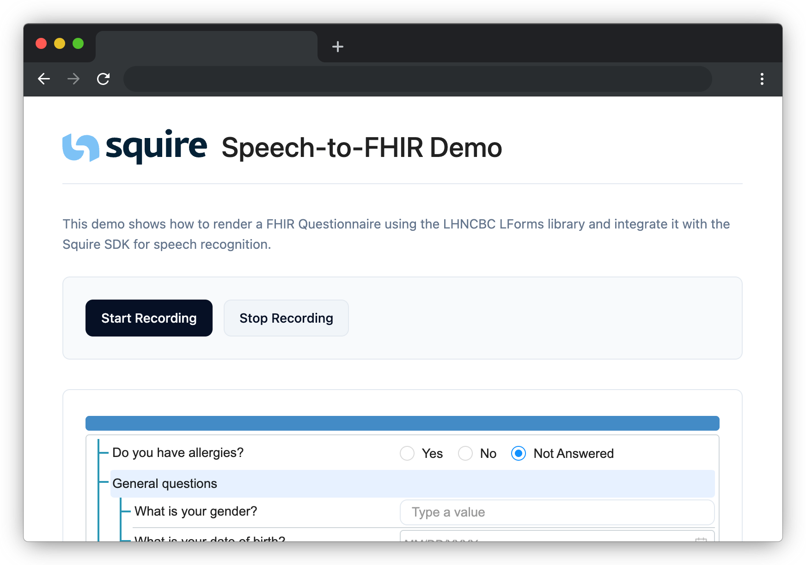

# Speech-to-FHIR Demo

This demo integrates the Squire Speech-to-FHIR SDK and renders the FHIR output with the open source LHNCBC LForms library.

<div align="center">
  
</div>

## Getting Started

### 1. Clone the repository and install dependencies

```sh
git clone https://github.com/squirehealth/speech-to-fhir-demo.git
cd speech-to-fhir-demo

echo "@squirehealth:registry=https://pkg.squire.eu/npm/
//pkg.squire.eu/npm/:_authToken=<YOUR_PACKAGE_REPOSITORY_TOKEN>" > .npmrc
npm install
npm run dev

# Now open your browser and navigate to:
# http://127.0.0.1:8080/
```

To run this, make sure you have installed [Node.js](https://nodejs.org/).

To get a `YOUR_PACKAGE_REPOSITORY_TOKEN`, please contact [Squire](https://squire.eu/).

### 2. Requesting an API key

1. Log in to the [Squire Portal](https://acc.squire.eu/) (create an account if you don't have one yet).
2. Navigate to the "API Keys" section in your account settings.
3. Click on "Create New API Key" and follow the prompts to generate your key.

> [!IMPORTANT]
> Your API key is a secret, and should not be exposed in client-side code.

### 3. Requesting an access token

An access token is required to authenticate your requests to the Squire API. You can obtain an access token by making a POST request to the token endpoint with your API key and user details.

```sh
curl -X POST "https://api-acc.squire.eu/api/v1/token/" \
  -H "X-Api-Key: <YOUR_API_KEY>" \
  -H "Content-Type: application/json" \
  -d '{"user_id": "example1234", "first_name": "doctor", "last_name": "123", "organisation": "practice_name"}'
```

Once you have the access token, add it to `index.html` to authenticate your requests via the Squire SDK.

> [!NOTE]
> In a real life application, you would request the access token per end user on your backend server. For simplicity reasons, we are hardcoding it in this demo.

## FHIR-A-THON 2025 - Next steps

We recommend first testing the included FHIR Questionnaire example. Once you are able to fill in the form with voice, we suggest the following tasks:

## 1. Creating a custom FHIRQuestionnaire structure

- Define the questionnaire JSON
- Add it to your organization via the Squire API (https://acc.squire.eu/api/v1/external/schema/redoc/#tag/templates/operation/templates_create)
- Render it locally in this web application using LForms and complete it

Any custom FHIRQuestionnaire can be used. To do so, first add them to Squire via the API. This will generate a `templateId` that you can use to reference the questionnaire in the SDK.

To render them locally in this demo, add them to the `assets` folder and request them in the `index.html` file.

### 2. Implement more SDK functionality

- Microphone selection (https://developers.squire.eu/integration/sdk/usage#get-microphones)
- pause/resume functionality (https://developers.squire.eu/integration/sdk/usage#pausing-and-resuming-a-consultation)
- "auto" language to recognise any language automatically (https://developers.squire.eu/languages)


### 3. Integrate the demo into your own web application

For the abmitious developers: a demo is cool, but can you integrate it in your own application?

The Squire SDK is developped to be integratable into any system. Via FHIR Questionnaires you can define the forms unique to your software.


## Testing with Virtual Audio Input

If you want to test the recording feature without speaking every time, you can use a virtual audio input to play a test audio file as your microphone input. This is useful for demoing or automating tests.

### macOS: Blackhole + GarageBand

1. **Install [Blackhole](https://existential.audio/blackhole/)** (free virtual audio driver).
2. **Install GarageBand** from the Mac App Store (or use any DAW that can route audio output to Blackhole).
3. Set up Blackhole as an aggregate device in Audio MIDI Setup, and select it as your system input.
4. Open GarageBand, import the test audio file (`assets/test_audio.wav`), and set the output device to Blackhole.
5. Start playback in GarageBand. Your browser/app will receive the audio as if it was coming from your microphone.

### Windows: VoiceMeeter + Audacity (or alternative DAW)

1. **Install [VoiceMeeter](https://vb-audio.com/Voicemeeter/)** (virtual audio mixer).
2. **Install [Audacity](https://www.audacityteam.org/)** (free audio editor) or use any DAW that can route audio output to VoiceMeeter.
3. Set VoiceMeeter Input as your default recording device in Windows Sound settings.
4. Open Audacity, import the test audio file (`assets/test_audio.wav`), and set the output device to VoiceMeeter.
5. Play the audio in Audacity. Your browser/app will receive the audio as microphone input.

> **Note:** You can use any DAW or audio player that allows you to select the output device. Alternatives to GarageBand on Windows include FL Studio, Reaper, or even the built-in Windows Media Player (with proper routing).

### Test Audio File

The repository includes a sample audio file at `assets/test_audio.wav` for testing purposes.

---
## Useful Links

- [Squire SDK Documentation](https://developers.squire.eu/): Guide on how to use the Squire SDK
- [Squire API Documentation](https://acc.squire.eu/api/v1/external/schema/redoc/): API reference for Squire's backend services
- [Squire Portal](https://acc.squire.eu/): Manage your account, API keys, and FHIR Questionnaires
- [FHIR Questionnaire Explorer](https://fhir-explorer.squire.eu/): Explore and test FHIR Questionnaires
- [FHIR Questionnaires](https://www.hl7.org/fhir/questionnaire.html): Official FHIR documentation on Questionnaires
- [LForms](https://github.com/LHNCBC/lforms): Library for rendering FHIR Questionnaires used in this demo

## About

This demo application is a minimal example to illustrate how the Squire SDK can be integrated into any web application. The SDK offers support for all frontend setups (React, Angular, Vue, plain JavaScript, etc.) as well as backend environments (Java, .NET, Python, etc.). No bundler is used here for simplicity purposes, but it works with any of your liking (Vite, Webpack, ...). TypeScript support is also included out of the box.

For more information, visit [the Squire website](https://squire.eu/).


